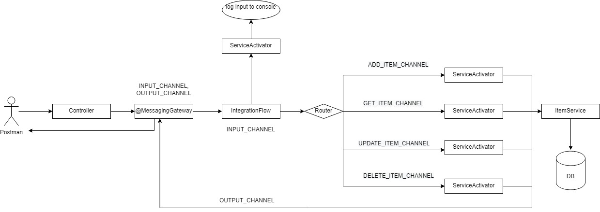

# Technology:
Spring Boot, Spring Integration, Kubernete, Docker
# Requirements:
## Development Phase
- Implement a simple application that support CRUD operation (create, edit, update, delete)
- Main flow: using Postman call to Api Endpoint -> Controller -> Integration Flow -> Database interaction
- Detail: build integration flow with these components:
  - DirectChannel
  - IntegrationFlow
  - @MessagingGateway
  - @Router
  - @ServiceActivator
## Testing Phase
- Write unit test using mockito, export coverage with Jacoco library
## Deployment Phase
- Dockerize application to image and push to dockerhub
- Deploy application using kubernete pod

# Application flow:
